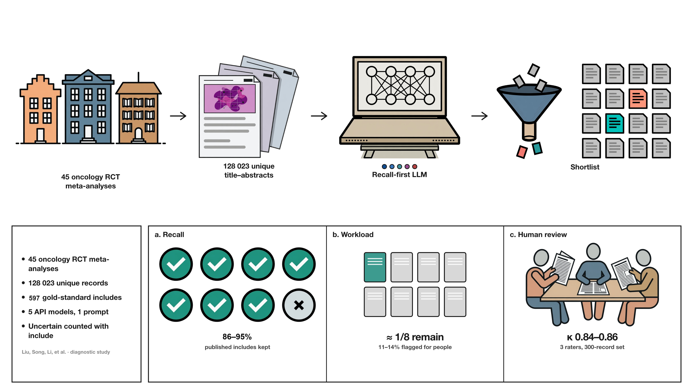
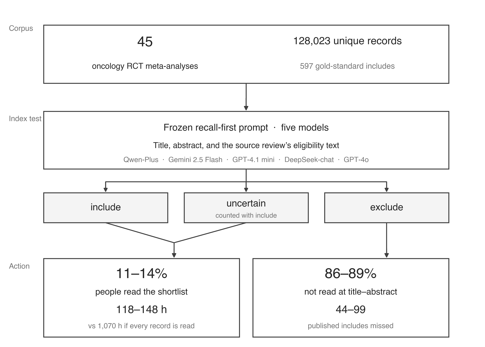

# Large language models for title and abstract screening in oncology systematic reviews

Code for the paper. One frozen recall-first prompt; five vendor APIs; humans read include or uncertain.





Bibliographic records from Embase/Ovid are not in this repo (vendor licence). Use your own RIS/CSV/JSON.

## Install

```bash
python3 -m venv .venv
source .venv/bin/activate
pip install -e .
```

```bash
cp .env.example .env   # add API keys
smeta-screen init --out ~/my_review
# edit criteria.txt and records.json
smeta-screen run --config ~/my_review/config.yaml
```

`--mock` runs the pipeline without API calls.

## Paper artefacts

- Production prompt: `smeta_screen/prompt_opt/frozen/prompts/smeta_recall_first.txt`
- Locked catalogue of 13 published templates: `smeta_screen/prompt_opt/frozen/`

Temperature 0. Uncertain is retained with include.

## Citation

If you use this code, please cite the paper:

Liu Y, Song Y, Li X, Deng J, Du Y, Qin C, Xu T. Large language models for title and abstract screening in oncology systematic reviews. *npj Digital Medicine* (in submission).

A `CITATION.cff` file is in the repo. GitHub → **Cite this repository**.

## Licence

Code is MIT. Using the code does not replace citing the paper.
